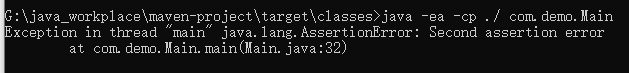
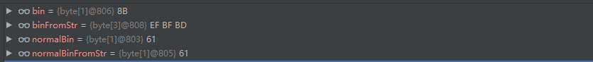

# byte数组转String的编码问题

最近项目遇到了一个诡异的问题，就是从服务器返回用gzip压缩过的json响应到客户端，但是会提示gzip压缩包已经损坏，经过研究后，把原因记录一下。


首先贴上一段代码，若果知道结果以及原因，那么后面的内容就可以不用看了。

```java
package com.demo;

import java.io.IOException;
import java.util.Arrays;

public class Main {

    public static void main(String[] args) throws IOException {

        byte[] normalBin = {97}; // 小写'a'的ascii码
        String normalStr = new String(normalBin);
        byte[] normalBinFromStr = normalStr.getBytes();
        assert Arrays.equals(normalBin, normalBinFromStr) : "First assertion error";

        byte[] bin = {-117};
        String str = new String(bin);
        byte[] binFromStr = str.getBytes();

        assert Arrays.equals(bin, binFromStr) : "Second assertion error";
    }
}
```

代码中我们主要关注的是两个断言结果会是什么，运行一下。（记得带上-ea参数，不然断言不起作用)

``` bash
java -ea -cp ./ com.demo.Main
```


结果如下



第二个断言错误出错了。这是为什么呢，同样是把一个byte数组先转为string，然后再转为byte数组，但是第一个断言就没有问题，但是第二个断言就报错了。

---

在探究原因之前，我们需要一点有关于编码的知识储备。

说起编码，我们就能立马想起ascii码，UTF-8，GBK2312等等的编码规则，那它们之间是一个怎么样的关系呢？

就拿ascii码和UTF-8来说，众所周知，ascii码是基于拉丁字母的一套电脑编码系统，主要用于显示现代英语和其他西欧语言，一共有128个字符，能表示52个字母（包括大写）以及0、1等数字，一些常用的符号（例如*、#、@等），还有控制字符或通信专用字符,如控制符：LF（换行）。对于表示英语等西欧语言来说，ascii码是已经足够了，但是对于表示其它语言，如汉语等，就显得力有不逮了，于是就有UTF-8等兼容ascii码的编码规则。


UTF-8是一种可变长度字符编码，它可以用一至四个字节对Unicode字符集中的所有有效编码点进行编码（ Unicode是一种包含所有符号的编码）。参考[UTF-8编码规则](https://blog.csdn.net/sandyen/article/details/1108168)这篇博客，我们了解了UTF-8的编码规则

		对于某一个字符的UTF-8编码，如果只有一个字节则其最高二进制位为0；如果是多字节，其第一个字节从最高位开始，连续的二进制位值为1的个数决定了其编码的位数，其余各字节均以10开头。
		如表：
		1字节 0xxxxxxx
		2字节 110xxxxx 10xxxxxx
		3字节 1110xxxx 10xxxxxx 10xxxxxx
		4字节 11110xxx 10xxxxxx 10xxxxxx 10xxxxxx

​	譬如，现在有一段字节流为

```
0x69 0xE6 0x88 0x91 //解码结果为"i我"
```

UTF-8在解码的时候，读到了0x69(0110 1001)，发现这个字节是最高为0，所以判断这个字节是单字节，就直接解码为小写字母`i`(对应ascii码的69)，然后继续读后一字节0xE6(1110 0110)，发现这是一个三字节的字符，就会往后继续读两个字节0x88(1000 1000)和0x91(1001 0001)，并且解码为汉字`我`。至此，解码完毕。


在对UTF-8编解码的工作过程有一个大概认识后，我们再来考虑一种情况，若果现在有如下的字节流，UTF-8会怎么处理?

```
0x8B
```

UTF-8读到字节0x8B(1000 1011)，发现这个字节并不对应上述编码规则的任何一条，这时候UTF-8会判断这个字节为无效字节，并且会用`0xEF` `0xBF` `0xBD` 这三个字节来替换这个无效字节。所以，当查看字节流的时候发现有

`0xEF` `0xBF` `0xBD` 这三个代表无效字节的标记时，就得检查是不是UTF-8转换出了问题了。

---

有了上面的知识储备后，就不难理解代码中为什么第二个断言会错误了，我们来看看它们的字节流是怎么样子的



normalBin转换前后，字节流都是61，但是bin转为字符串再转回字节数组后，它的值很明显从0x8B(十进制为-117)变为`0xEF` `0xBF` `0xBD`，因为String的默认编码方式是UTF-8。

---


那为什么会出现无效字节呢？其实这个就是我的项目中碰到的问题。

项目需要使用gzip压缩文件，压缩过后会返回byte数组，但是经过网关的时候，因为某些原因，把这个byte数组强行转为String，导致一些字节丢失，从而导致压缩文件损坏。


所以说，人家本来就是需要用byte数组才能正常工作，但是你却把人家变为String，那出错了就不意外了。类似的还有上传图片后损坏等等，也有可能是因为这个原因导致。